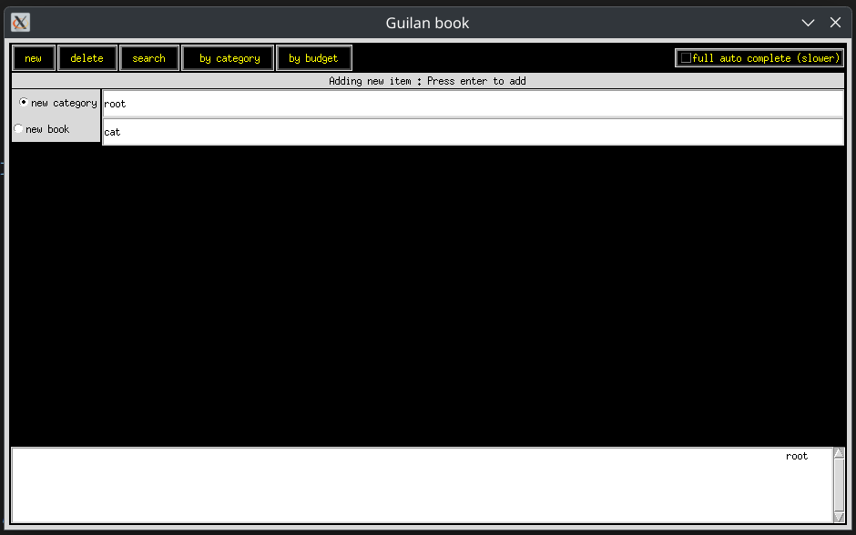
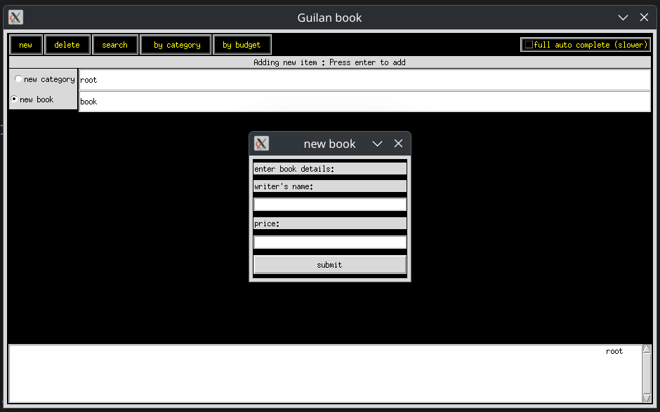
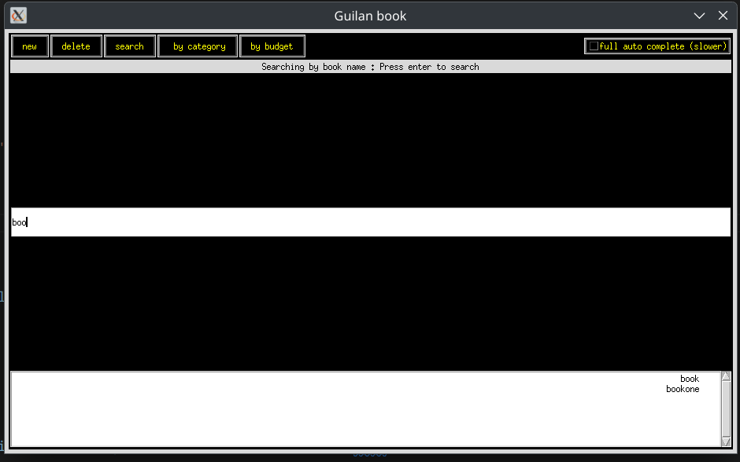
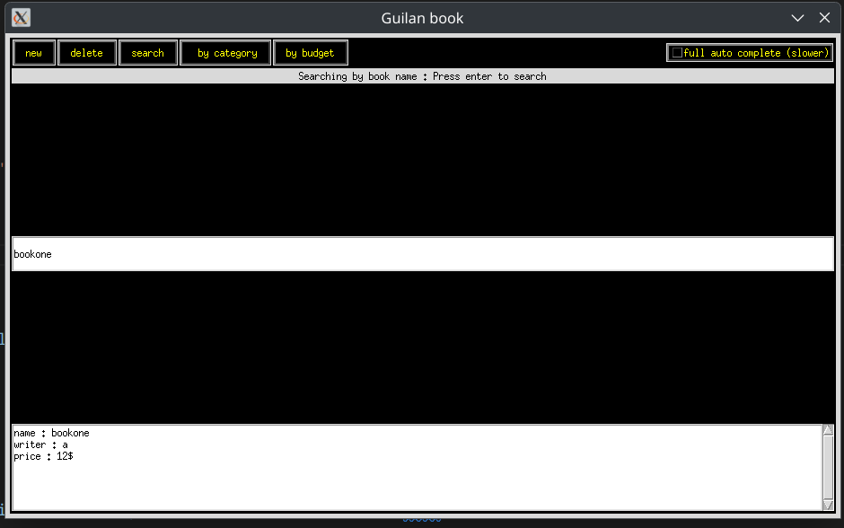

# Data-Structures-and-Algorithms-Project-3-Book-Exchange-Platform

This project is the final assignment for the **Data Structures and Algorithms** course (Term 14021, Dr. Mirroshandel, University of Guilan). The goal was to design and implement a system that allows students to **buy and sell second-hand textbooks** in an organized and efficient way using tree-based data structures.

## 🔍 Features

* **Category-Based Listing**: Users can list or browse books based on predefined categories (e.g., Computer Science, Math).
* **Efficient Search with Suggestions**: Implements a **prefix tree (Trie)** for real-time search suggestions (autocomplete) based on book titles.
* **Insert/Search Operations**: Fast insertion and lookup operations using tree structures.
* Some additional features were also implemented
## Pictures

